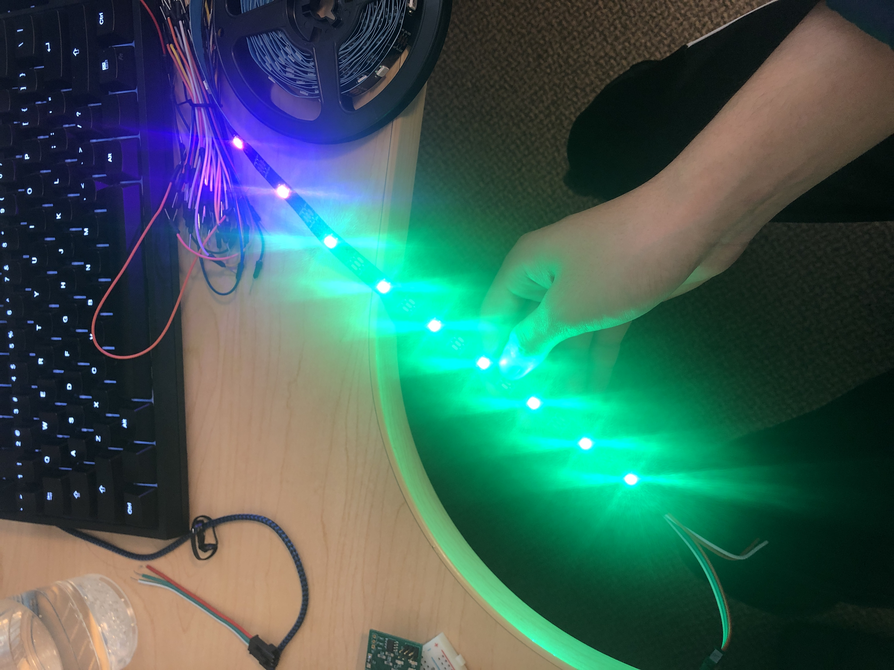
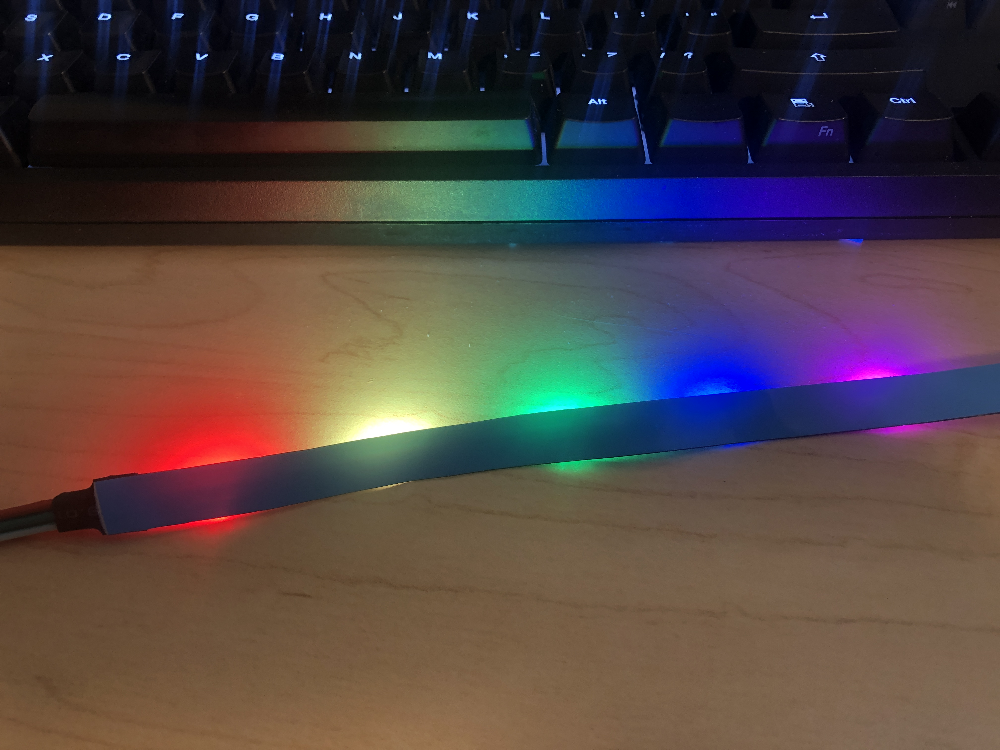

# Advanced Blinky: STM32 controlled Neopixels

## Project Goal

Our goal from the begining of the project has been to "develop a NeoPixel library that runs on STM32 microcontrollers." For context, a NeoPixel is an RGB LED sold by Adafruit, and comes in strips such that each light is can be controlled independently via a proprietary digital signal. We knew that this development goal would help us satisfy our learning goals of becoming familiar with STM32 development, learning about embedded buildchains, and getting more practice debugging embedded code, and we have achieved all of those learning goals by this point in the project.

## Summary of work

We just completed the project MVP! We have a working library that is able to accurately control the states of a Neopixel strip. Check out our trello [here](https://trello.com/b/4Y54vG8e/advancedblinky) for an overview of what we've done. 

Our development goal entails the following work which we have completed
* Writing a C abstraction for an array of NeoPixel LEDs (Wesley)
* Writing functions that allow us to change the C abstraction of a NeoPixel LED (Wesley)
* Writing code that converts our abstraction into bits to be sent digitally (Alex)

It also entails the following task, which has proved difficult
* Sending the digital bits to control the LEDs at the appropriate speed (originally Alex, now both of us)

### Since the update:

* We've successfully implemented PWM control of the lights using DMA to send the individual bit data.
    * This has allowed us to successfullly address each individual LED in the neopixel strip
    * We ran into a couple of bugs with our math in terms of fetching bits from the message buffer, but have since resolved all of them.


### Key takeaway

Hardware Abstraction Layers (HALs) make it easy to start developing code on unfamiliar hardware. HAL's also make it hard to write very fast code. Trying to write fast code on unfamiliar hardware (i.e. writing low level code on that hardware) is very hard.

## Lessons Learned

* PLL's allow you to increase the speed of a clock signal ([link here](http://fastbitlab.com/stm32-pll-programming-fundamentals-2/))
* HAL's give you high level control over hardware, without having to really think about the hardware ([docs here](https://www.st.com/resource/en/user_manual/dm00154093-description-of-stm32f1-hal-and-lowlayer-drivers-stmicroelectronics.pdf))
* HAL's introduce overhead that slows down your code. This isn't an issue for most programs, but makes writing code that loops quickly nearly impossible.
    * The "official" implementation of the Neopixel library from Adafruit does not use a HAL; it actually is written in bare assembly code, presumably to meet the fast timing requirements

## Results

We successfully got the Neopixels to light up on command! Here are a few images of a segment of LEDs.




## Design Decisions

One key design consideration we made was how to implement the hardware layer of the control. The Neopixels are controlled by sending precisely timed pulses through one digital GPIO pin, and we had to hit timeslots as low as 0.4 microseconds. Our first intention was to use a timer running at 2.5MHz and manually toggle the pin state, but after many attempts at running a timer callback that quickly, we realized this is not feasible. It's still unclear if we were running into a limitation of the GPIO pins, the timer callback, or the HAL library, but we suspect it was extra overhead from the HAL library and the context switching that was limiting our performance. Instead, we found a method to use PWM to control the pulses. Initially, we were hesitant to go down this route because we would have to change the PWM duty cycle every period; normally, the duty cycle of PWM changes on an order of magnitude slower than the period. However, we learned that DMA (direct memory access) can be used to transfer the requested duty cycle into the PWM duty cycle register quickly enough to not miss any pulses.

### Code snippets

* Initializing the Neopixel object

```clike
Neopixel_t *neo_initialize_strip(int num_leds) {
    Neopixel_t *neo = malloc(sizeof(Neopixel_t));

    // Check that malloc is successful
    if (neo == NULL) {
        return NULL;
    }

    neo->num_pixels = num_leds;
    neo->buffer_size = num_leds * NEO_PIXEL_MSG_SIZE_BYTES;
    neo->buffer = malloc(neo->buffer_size * sizeof(uint8_t));

    // Check that malloc is successful
    if (neo->buffer == NULL) {
        return NULL;
    }

    // Clear neo_buffer
    for (size_t i = 0; i < neo->buffer_size; i++) {
        neo->buffer[neo->buffer_size] = 0;
    }

    neopixel = neo;
    return neo;
}
```

> One workaround we had to use here was to set a global variable `neopixel` as the active neopixel. When the `led_render` function is called, it references the `neopixel` variable to find all of the data. The reason why we had to use this is because there is no way to add parameters to the callback function, so we could not pass a `Neopixel_t` object into the callback.


* Filling the write buffer `wr_buf` with data to send as PWM duty cycles
```clike
int num_pixels = neopixel->num_pixels;
if (neo_dma_index < num_pixels) {
    for(uint_fast8_t i = 0; i < 24; i++) {
        wr_buf[i] = (neopixel->buffer[(i/8) + (neo_dma_index * NEO_PIXEL_MSG_SIZE_BYTES)] & (1 << (i % 8))) ? PWM_HI : PWM_LO;
    }
    neo_dma_index++;
} else if (neo_dma_index < num_pixels + 2) {
    // 1.25 us per bit * 24 bits per pixel = 30 us per pixel.
    // 2 pixels or 60 us is enough to reset
    for (uint8_t i = 0; i < (48 / 2); i++) {
        wr_buf[i] = 0;
    } 
    neo_dma_index++;
} else {
    // Sending complete, stop until next led_render call
    neo_dma_index = 0;
    HAL_TIM_PWM_Stop_DMA(&htim2, TIM_CHANNEL_1);
}
```

> This happens in the DMA interrupt callback function, which gets called twice per DMA cycle, once at the halfway point and once when the DMA cycle is finished. This code is from the halfway point; slightly different code is called at the end of the cycle. These pieces of code fills half of the DMA buffer (`wr_buf`) with data from the neopixel buffer.

## Reflection

Our final code landed closer to the MVP than we expected. After running into many road blocks in getting the hardware to run fast enough, we scaled back our goals to getting a functional library.

I'm happy to say that both of us achieved our learning goals. We learned a lot about developing for embedded systems, from creating the buildchain and surrounding infrastructure to flash the microcontrollers, to reading and understanding datasheets, to writing firmware the accesses and writes appropriate registers.

## Links

* [Trello](https://trello.com/b/4Y54vG8e/advancedblinky)
* [Github](https://github.com/awenstrup/AdvancedBlinky)
